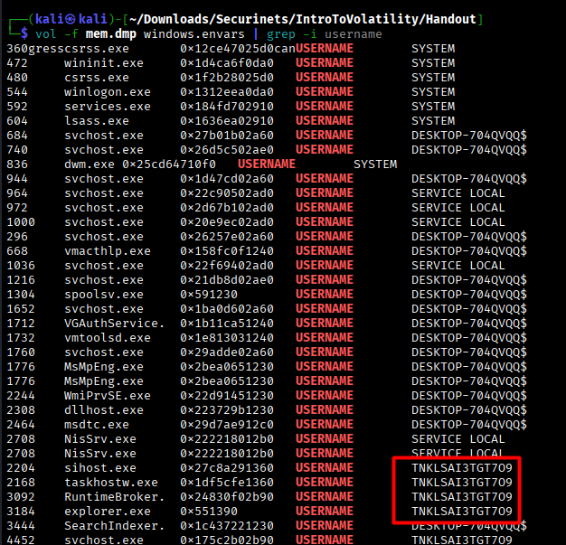
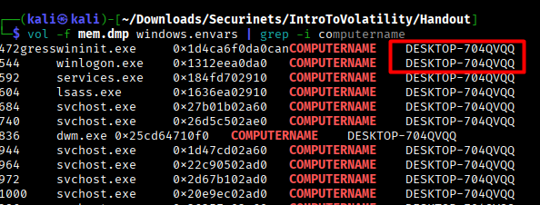
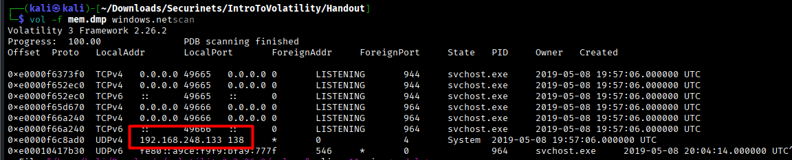
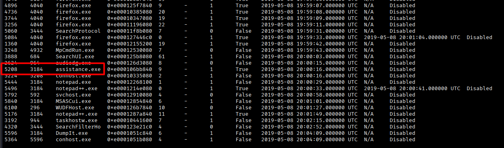
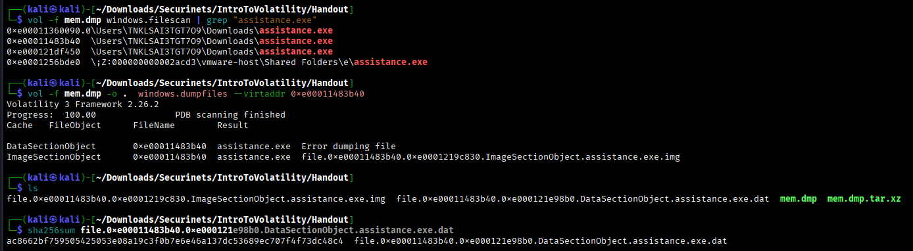
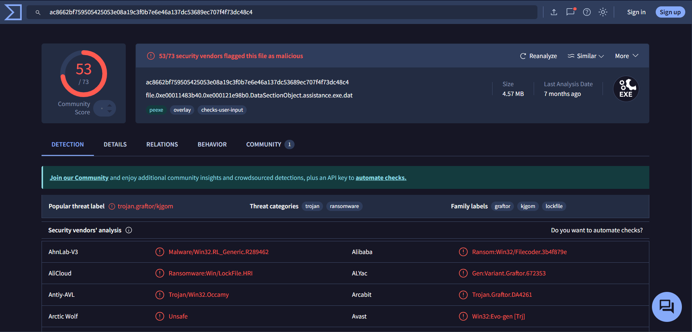

## Challenge Description

> "Analyze the provided Windows memory dump and answer the forensic questions to reveal the flag."

This challenge introduces participants to **Windows memory forensics** using **Volatility 3**. By analyzing a memory dump (`mem.dmp`), players must extract system information, identify malicious activity, and recover a file hash to reconstruct the full flag.

---

## Solution Walkthrough

> 💡 **Tip**: All commands are run using **[Volatility 3](https://github.com/volatilityfoundation/volatility3)**. The memory dump is named `mem.dmp`.  
> For a quick reference of plugin mappings between Volatility 2 and 3, see: [Volatility 3 CheatSheet](https://blog.onfvp.com/post/volatility-cheatsheet)

---

### 🔍 Step 1: Identify the Logged-in Username

Run:
```bash
vol -f mem.dmp windows.envars | grep -i username
``` 


The windows.envars plugin lists environment variables for all processes. The interactive user (not SYSTEM or service accounts like DESKTOP-704QVQQ$) is the one running explorer.exe, firefox.exe, and the suspicious assistance.exe.

✅ Answer: TNKLSAI3TGT7O9

### 💻 Step 2: Find the Machine (Computer) Name

Run:
```bash
vol -f mem.dmp windows.envars | grep -i computername
``` 


All processes consistently report the same machine name via the COMPUTERNAME environment variable.

✅ Answer: DESKTOP-704QVQQ

### 🌐 Step 3: Extract the Non-Local IPv4 Address

Run:
```bash
vol -f mem.dmp windows.netscan
``` 


The windows.netscan plugin lists active network connections. Look for UDP/TCP entries with a concrete IPv4 (not 0.0.0.0 or 127.0.0.1).

✅ Answer: 192.168.248.133

### 🧨 Step 4: Identify the Malicious Executable Name

Run:
```bash
vol -f mem.dmp windows.pslist
``` 



After analysis, we find several processes that appear to be legitimate (firefox.exe, notepad.exe, OneDrive.exe, etc.). However, one of them appears suspicious. It is assistance.exe with PID 5208. Indeed, this is not a process we usually observe.

✅ Answer: assistance.exe

### 🆔 Step 5: Get the PID of assistance.exe

From the same output above, the PID is: 5208

✅ Answer: 5208

### 🔐 Step 6: Extract and Hash the Malware Binary

Step 6.1: Locate the file in memory

Run:
```bash
vol -f mem.dmp windows.filescan | grep "assistance.exe"
``` 
Step 6.2: Dump the file

Run:
```bash
vol -f mem.dmp windows.filescan | grep "assistance.exe"
``` 
Step 6.3: Compute SHA256 hash

Run:
```bash
sha256sum file.0xe00011483b40.0xe000121e98b0.DataSectionObject.assistance.exe.dat
``` 


✅ Answer: ac8662bf759505425053e08a19c3f0b7e6e46a137dc53689ec707f4f73dc48c4

Verify Malware on VirusTotal (Optional but Convincing)



🏁 Final Flag
After answering all six questions correctly:

✅ **Flag**: `Securinets{W3lc0me_To_M3M0ry_An4lys1s}`

### 💡 Key Takeaways

- `envars` reveals user and host context without registry access.
- `netscan` exposes real network IPs and connections.
- `filescan` + `dumpfiles` enables file extraction from memory—critical for malware analysis.
- Hashes provide immutable evidence in forensic investigations.

> 🔒 This challenge mirrors real-world incident response workflows.

---

### 📚 References

- [Volatility 3 GitHub Repository](https://github.com/volatilityfoundation/volatility3/tree/develop/volatility3)  
- [Volatility 3 CheatSheet – blog.onfvp.com](https://blog.onfvp.com/post/volatility-cheatsheet)
