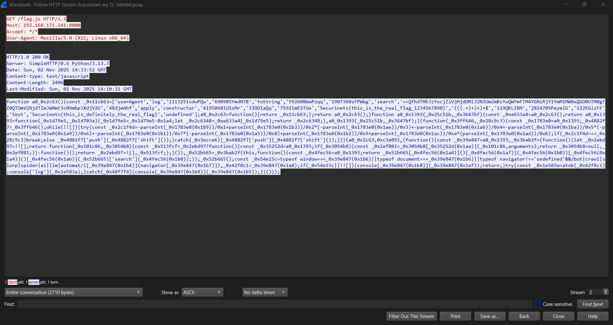
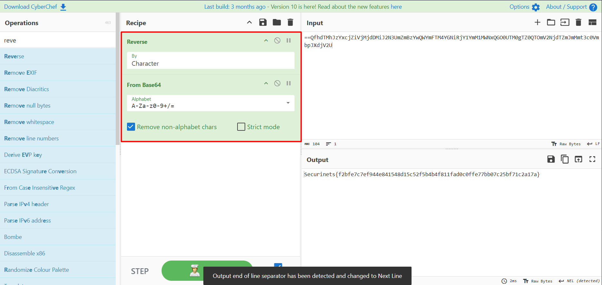

## Challenge Description

> "Analyze the provided PCAP file and recover the flag."

This forensics challenge involves network traffic analysis, file extraction, JavaScript deobfuscation, and data decoding. Participants must extract an obfuscated JavaScript file from HTTP traffic, deobfuscate it to reveal a reversed Base64 string, and decode it to uncover the real flag.

---

## Solution Walkthrough

### 🕵️‍♂️ Step 1: Extract the Downloaded File from PCAP

Open `b4mb0.pcap` in **Wireshark** and look for HTTP traffic.

- Apply the display filter: `http`
- Locate the **HTTP GET request** for `/flag.js`:

- Right-click the corresponding **HTTP 200 OK** response packet →  
  **Follow → HTTP Stream**  
  or go to **File → Export Objects → HTTP**

- Save the object named `flag.js`.

> ✅ You now have the obfuscated JavaScript payload.

 

---

### 🔐 Step 2: Deobfuscate the JavaScript Code

The `flag.js` file contains heavily obfuscated JavaScript that hides a Base64 string and fake flags.

To deobfuscate it:
- Go to **[https://obf-io.deobfuscate.io](https://obf-io.deobfuscate.io)**
- Paste the raw `flag.js` content
- Click **Deobfuscate**

The output will reveal multiple fake flags and a suspicious Base64-like string that **starts with `==`**, indicating it’s likely **reversed**:

```javascript
// ... fake flags ...
"Securinets{this_is_definitely_the_real_flag}",
"Securinets{fake_flag_do_not_submit_1234567890}",

// ... and the real payload ...
"==QfhdTMhJzYxcjZiVjMjdDMiJ2N3UmZmBzYwQWYmFTM4YGNiRjY1YmM1MWNxQGO0UTM0gTZ0QTOmV2NjdTZmJmMmt3c0VmbpJXdjV2U"
```


### 🔓 Step 3: Decode the Reversed Base64 String

The string:

("==QfhdTMhJzYxcjZiVjMjdDMiJ2N3UmZmBzYwQWYmFTM4YGNiRjY1YmM1MWNxQGO0UTM0gTZ0QTOmV2NjdTZmJmMmt3c0VmbpJXdjV2U")

is **not valid Base64** in this orientation — but notice it **ends with `U`** and **begins with `==`**, a strong hint that it’s **reversed**.

Use **[CyberChef](https://gchq.github.io/CyberChef/)** to decode it:

1. Paste the string into the CyberChef input
2. Apply these operations (in order):
   - **Reverse**
   - **From Base64**

> 📎 
The result is:

✅ **Flag**: `Securinets{f2bfe7c7ef944e841548d15c52f5b4b4f811fad0c0ffe77bb07c25bf71c2a17a}`

---

### 💡 Key Takeaways

- Always inspect **HTTP objects** in PCAPs — files are often hidden in plain sight.
- Obfuscated scripts may contain **reversed or encoded payloads** — look for anomalies like `==` at the **start**.
- Tools like **[https://obf-io.deobfuscate.io](https://obf-io.deobfuscate.io)** and **[CyberChef](https://gchq.github.io/CyberChef/)** are essential for quick reverse-engineering in CTFs.

---

### 📚 Tools Used

- **[Wireshark](https://www.wireshark.org/)** – Network protocol analyzer  
- **[https://obf-io.deobfuscate.io](https://obf-io.deobfuscate.io)** – JavaScript deobfuscator  
- **[CyberChef](https://gchq.github.io/CyberChef/)** – Data decoding & transformation  

> 🔒 **Note**: The fake flags in the script are intentional red herrings — always verify decoded output!
