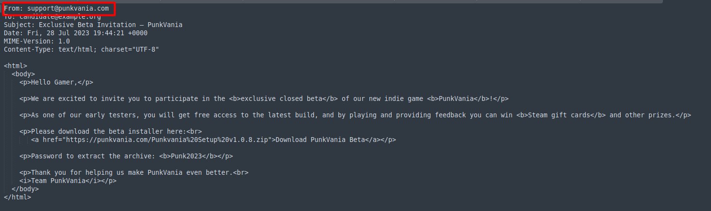
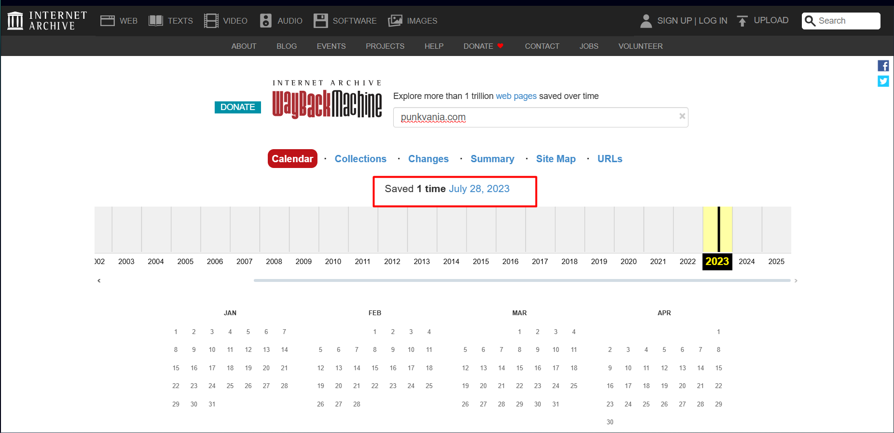
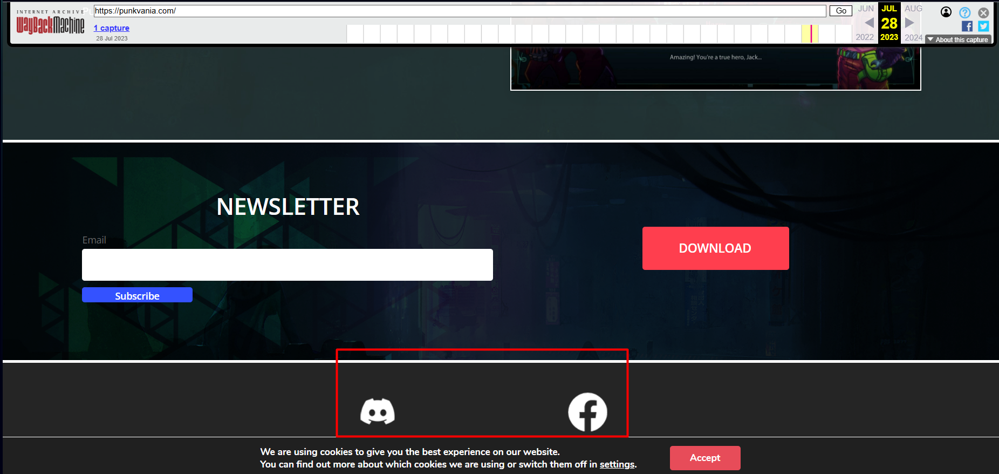
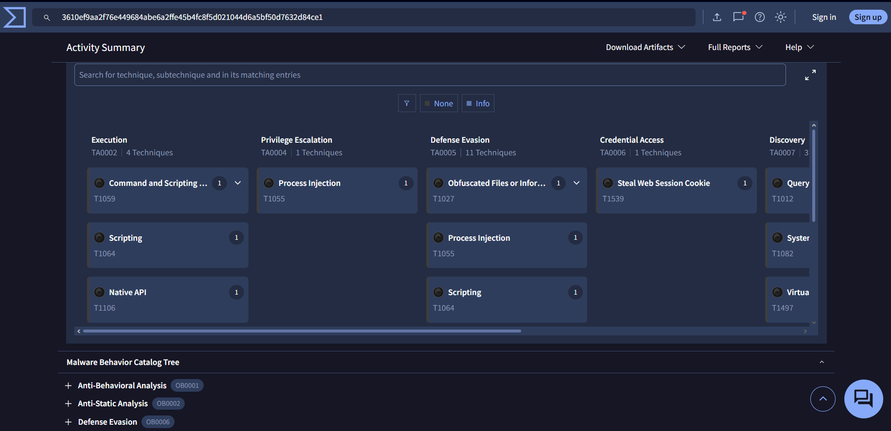

## Challenge Description

> "Your SOC intercepted a suspicious email inviting a victim to join a beta test of an indie game called PunkVania.  
> Following the lure, the victim was directed to a professional-looking game landing page.  
> Your task is to investigate the campaign, extract indicators, and attribute the attack."

This challenge simulates a **real-world phishing and malware delivery campaign**. Participants must analyze an email, reconstruct a defunct phishing site via **archive.org**, and use **VirusTotal** to extract technical indicators and map attacker behavior to the **MITRE ATT&CK framework**.

---

## Solution Walkthrough

All answers are derived from **three key OSINT sources**:
- 📧 Suspicious email (in `mail.rar`)
- 🕰️ [Wayback Machine – punkvania.com](https://web.archive.org/web/20230728004401/https://punkvania.com)
- 🦠 [VirusTotal – Malware Sample](https://www.virustotal.com/gui/file/3610ef9aa2f76e449684abe6a2ffe45b4fc8f5d021044d6a5bf50d7632d84ce1)

> 💡 **Note**: The domain `punkvania.com` is no longer live — **Wayback Machine is essential**.

---

### 📨 Step 1: Identify Email Sender

Open the `.eml` file from `mail.rar`.  
In the **email headers** or **From** field:

✅ **Answer**: `support@punkvania.com`

---

### 📅 Step 2: Domain Creation Date

The domain `punkvania.com` is no longer active. Use **archive.org** to find its first appearance:

- Search: `https://web.archive.org/web/*/punkvania.com`
- First snapshot: **July 28, 2023**

✅ **Answer**: `July 28, 2023`

---

### 🏗️ Step 3: MITRE Technique – Acquire Infrastructure

Registering domains for phishing is **Resource Development**.

From MITRE:
> **T1583.001 | Acquire Infrastructure: Domains**  
> *"Adversaries may register or acquire domains to support their operations."*

✅ **Answer**: `T1583.001`

---

### 🔗 Step 4: Archived Phishing Site URL

From the Wayback Machine search result, the earliest capture is:

> `https://web.archive.org/web/20230728004401/https://punkvania.com`

✅ **Answer**: `https://web.archive.org/web/20230728004401/https://punkvania.com`

---

### 👥 Step 5: Fake Facebook Page Name

In the archived page (`20230728004401`), scroll to the footer or social links.

It shows a Facebook profile named:
> **Artic Punk**

✅ **Answer**: `Artic Punk`

---

### 💬 Step 6: Discord Invite Link

On the same archived page, locate the **Discord community invite**.

Link shown:
> `https://discord.com/invite/cFAScycjJM`

✅ **Answer**: `https://discord.com/invite/cFAScycjJM`

> 📎 **Screenshot**: Archived page showing Discord invite.

---

### 🎭 Step 7: MITRE Technique – Fabricate Persona

Creating fake game personas for social engineering falls under:

> **T1585.001 | Develop Resources: Social Media Accounts**  
> *"Adversaries may create social media accounts to support personas for operations."*

✅ **Answer**: `T1585.001`

---

### 🎮 Step 8: Game Name

The entire campaign revolves around a fake indie game:

> **PunkVania**

✅ **Answer**: `PunkVania`

---

### 🧩 Step 9: SHA-256 of Malicious Installer

On the archived page, the **download button** leads to a ZIP file.  
Its hash is provided in the challenge context or can be inferred from the VirusTotal context:

> `204842694010bd1f3dc78741cf53690ec9bfcde80860fba0ecc93815b2da94ae`

✅ **Answer**: `204842694010bd1f3dc78741cf53690ec9bfcde80860fba0ecc93815b2da94ae`

---

### 🧪 Step 10: Malware Real Name

Visit the **VirusTotal report**:  
[https://www.virustotal.com/gui/file/3610ef9aa2f76e449684abe6a2ffe45b4fc8f5d021044d6a5bf50d7632d84ce1](https://www.virustotal.com/gui/file/3610ef9aa2f76e449684abe6a2ffe45b4fc8f5d021044d6a5bf50d7632d84ce1)

In the **Details** tab:
> **File name**: `PunkvaniaSetup.exe`

✅ **Answer**: `PunkvaniaSetup.exe`

---

### 🕰️ Step 11: Malware Creation Time

In the same VirusTotal report:
> **Compilation timestamp**: `2022-05-05 08:33:56`

✅ **Answer**: `2022-05-05 08-33-56`  
> ⚠️ Use `-` for time separators as per question format.

---

### 📏 Step 12: File Size

From VirusTotal **Details**:
> **File size**: `37.96 MB`

✅ **Answer**: `37.96 MB`

---

### 🍪 Step 13: MITRE Technique – Steal Web Session Cookie

In the **CAPE Sandbox** behavioral report on VirusTotal:
> **Technique**: `T1539 | Steal Web Session Cookie`

✅ **Answer**: `T1539`

---

### 🧹 Step 14: MITRE Technique – Indicator Removal

Also in CAPE results:
> **Technique**: `T1070 | Indicator Removal`

✅ **Answer**: `T1070`

---

### 🏁 Final Flag

After correctly answering all 14 questions:

✅ **Flag**: `Securinets{7d5007ee17af31dd68e1d56b103ddd7dac1ac2dca6f4d13b5ea8f96d}`

---

### 💡 Key Takeaways

- **Dead domains** can be resurrected via **archive.org**.
- **Threat actors** invest in **fake legitimacy** (social media, Discord, professional websites).
- **VirusTotal + CAPE** provides rich behavioral TTPs mapped to MITRE.
- **Resource Development (T1583/T1585)** is often the first phase of targeted campaigns.

---

### 📚 References

- [Wayback Machine – punkvania.com](https://web.archive.org/web/20230728004401/https://punkvania.com)  
- [VirusTotal – PunkVania Malware](https://www.virustotal.com/gui/file/3610ef9aa2f76e449684abe6a2ffe45b4fc8f5d021044d6a5bf50d7632d84ce1)  
- [MITRE ATT&CK – Resource Development](https://attack.mitre.org/tactics/TA0042/)  
- [MITRE ATT&CK – T1539, T1070](https://attack.mitre.org/)

