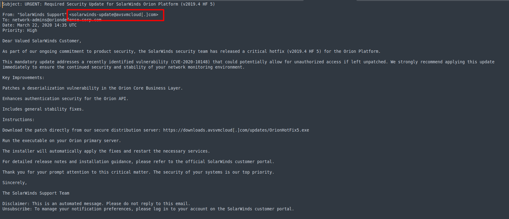
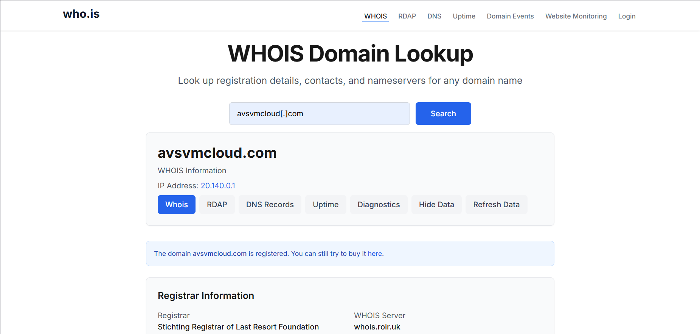
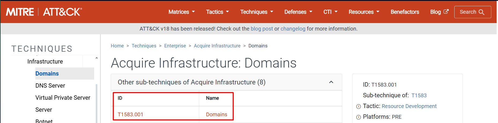
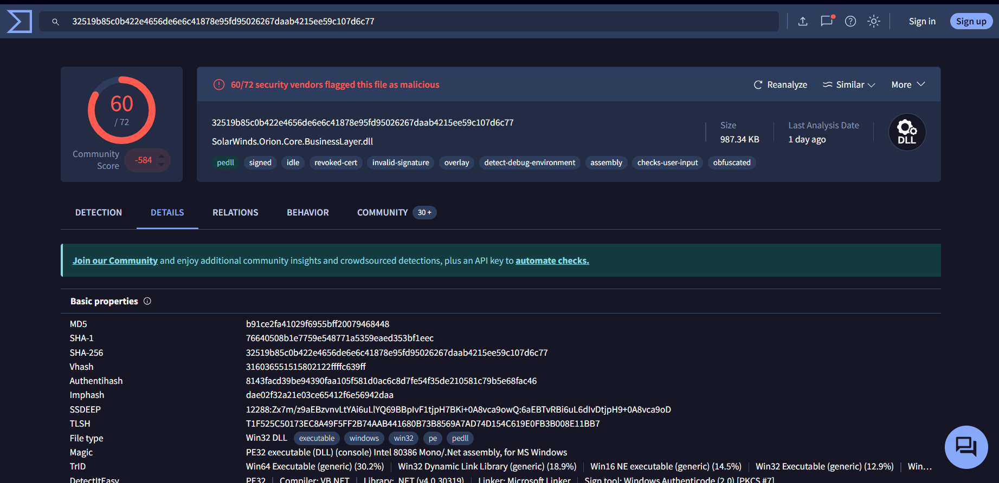

## Challenge Description

> "You are a new Threat Intelligence Analyst at 'Securinets TEK-UP'.  
> Your team has discovered a suspicious email sent to a senior network administrator during the height of the SolarWinds campaign.  
> Your task is to investigate this lead, uncover the tactics, techniques, and procedures (TTPs) used, and identify key indicators of compromise."

This challenge tests your ability to perform **real-world threat intelligence analysis** using public sources. By leveraging **email headers**, **WHOIS records**, **VirusTotal**, and the **MITRE ATT&CK framework**, you’ll reconstruct the TTPs of one of the most sophisticated supply chain attacks in history: **SolarWinds (C0024)**.

---

## Solution Walkthrough

All answers are derived from **three key public sources**:
- 📧 Email headers (provided in `IOC.rar`)
- 🔍 [WHOIS for `avsvmcloud.com`](https://who.is/whois/avsvmcloud.com)
- 🦠 [VirusTotal report](https://www.virustotal.com/gui/file/32519b85c0b422e4656de6e6c41878e95fd95026267daab4215ee59c107d6c77)
- 🛡️ [MITRE ATT&CK – SolarWinds Compromise (C0024)](https://attack.mitre.org/campaigns/C0024)

> 💡 **Bonus learning**: [SolarWinds Deep Dive (YouTube)](https://youtu.be/Eq6ATHhBezw?si=GDxxJXhV42plJpLA)

---

### 📨 Step 1: Extract Sender Email Address

Open the email (`.eml` or `.msg`) from the `IOC.rar` archive.  
In the **email headers**, locate the `From:` field:
`From: "SolarWinds Support" <solarwinds-update@avsvmcloud[.]com>`

✅ **Answer**: `solarwinds-update@avsvmcloud.com`

> 📎 

---

### 🌐 Step 2: Domain Creation Date via WHOIS

Go to: [https://who.is/whois/avsvmcloud.com](https://who.is/whois/avsvmcloud.com)

Under **Important Dates**:
> **Created**: `7/25/2018`

✅ **Answer**: `7/25/2018`

> 📎 

---

### 📍 Step 3: Domain’s IPv4 Address During Campaign

From the same WHOIS page or via historical DNS records, the IP associated with `avsvmcloud.com` during the SolarWinds campaign was:

> **20.140.0.1**

> 💡 Confirmed in threat reports and MITRE C0024.

✅ **Answer**: `20.140.0.1`

---

### 🏗️ Step 4: MITRE Technique – Acquire Infrastructure: Domains

Visit: [MITRE ATT&CK – SolarWinds Compromise (C0024)](https://attack.mitre.org/campaigns/C0024)

In the **Techniques Used** table:
> **T1583.001 | Acquire Infrastructure: Domains**  
> *"For the SolarWinds Compromise, APT29 acquired C2 domains, sometimes through resellers."*

✅ **Answer**: `T1583.001`

> 📎 

---

### 🕰️ Step 5: Malware Creation Time

Open the **VirusTotal report**:  
[https://www.virustotal.com/gui/file/32519b85c0b422e4656de6e6c41878e95fd95026267daab4215ee59c107d6c77](https://www.virustotal.com/gui/file/32519b85c0b422e4656de6e6c41878e95fd95026267daab4215ee59c107d6c77)

In the **Details** tab, look for **"Creation Time"**.

> **Compilation timestamp**: `2020-03-24 08:52:34`

✅ **Answer**: `2020-03-24 08-52-34`  

> 📎 
---

### 📁 Step 6: File Type of Malicious DLL

In the same VirusTotal report, under **Details** :

> **File type**: `PE32 executable (DLL)`

✅ **Answer**: `PE32`

---

### 🧩 Step 7: Full Filename of Trojanized DLL

From public reporting and MITRE C0024:

> The malicious DLL injected into SolarWinds Orion was:  
> **`SolarWinds.Orion.Core.BusinessLayer.dll`**

Also confirmed in Mandiant/FireEye reports.

✅ **Answer**: `SolarWinds.Orion.Core.BusinessLayer.dll`

---

### 🕵️‍♂️ Step 8: Attributed APT Group

From MITRE C0024 description:
> *"The SolarWinds Compromise was a sophisticated supply chain cyber operation conducted by **APT29**..."*

Also known as **Cozy Bear**, **The Dukes**, or **Nobelium**.

 
✅ **Answer**: `APT29`

---

### 🌍 Step 9: Nation-State Affiliation

MITRE and US/UK government attributions state:
> *"Attributed to **Russia's Foreign Intelligence Service (SVR)**."*

✅ **Answer**: `Russia`

---

### 🧠 Step 10: MITRE Software ID – Raindrop Loader

From MITRE C0024 **Software** section:
> **S0565 | Raindrop**  
> *"During the SolarWinds Compromise, APT29 used 7-Zip to decode their **Raindrop** malware."*

✅ **Answer**: `S0565`

---

### 🔗 Step 11: MITRE Technique – Supply Chain Compromise

In **Techniques Used**:
> **T1195.002 | Supply Chain Compromise: Compromise Software Supply Chain**  
> *"APT29 gained initial access via a trojanized update of SolarWinds Orion software."*

✅ **Answer**: `T1195.002`

---

### ⏳ Step 12: MITRE Technique – WMI Event Subscription for Persistence

From **Techniques Used**:
> **T1546.003 | Event Triggered Execution: Windows Management Instrumentation Event Subscription**  
> *"APT29 used a WMI event filter to invoke a command-line event consumer at system boot time to launch a backdoor."*

✅ **Answer**: `T1546.003`

---

### 🏁 Final Flag

After correctly answering all 12 questions:

✅ **Flag**: `Securinets{b91e418eee3f0e7510ab6ad9dd9f6b66aae070bfa77c47fea775a4b3}`

---

### 💡 Key Takeaways

- **Email headers** are rich sources of IOCs (sender, routing IPs).
- **WHOIS** reveals domain registration timelines — critical for attribution.
- **VirusTotal** provides file metadata, hashes, and community analysis.
- **MITRE ATT&CK** maps real-world behavior to standardized TTPs.
- The **SolarWinds attack** exemplifies how nation-state actors combine **supply chain compromise**, **infrastructure acquisition**, and **living-off-the-land** techniques.

---

### 📚 References

- [MITRE ATT&CK – SolarWinds Compromise (C0024)](https://attack.mitre.org/campaigns/C0024)  
- [VirusTotal – SUNBURST/Raindrop Sample](https://www.virustotal.com/gui/file/32519b85c0b422e4656de6e6c41878e95fd95026267daab4215ee59c107d6c77)  
- [WHOIS – avsvmcloud.com](https://who.is/whois/avsvmcloud.com)  
- [SolarWinds Deep Dive (FireEye/Mandiant)](https://youtu.be/Eq6ATHhBezw?si=GDxxJXhV42plJpLA)

